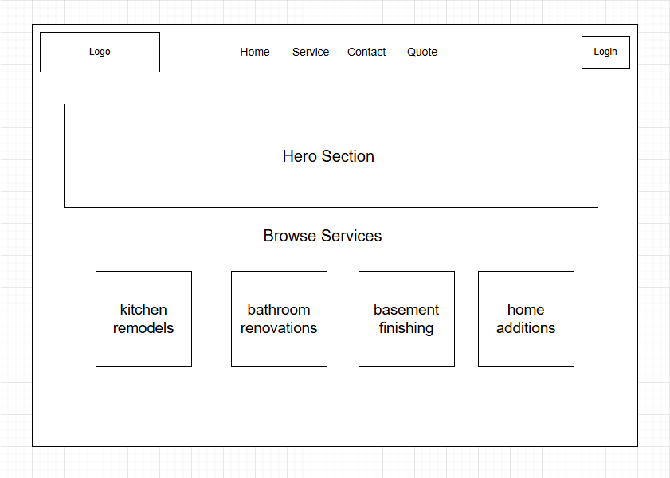
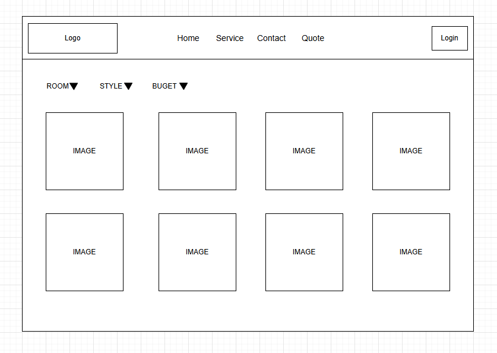
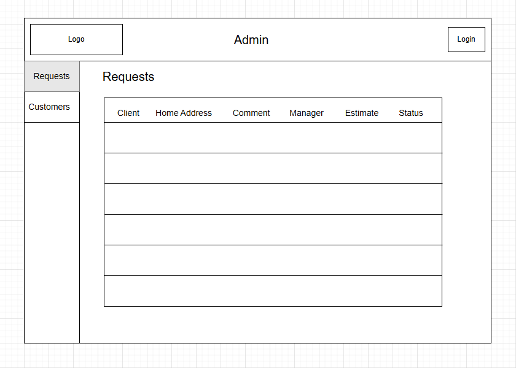
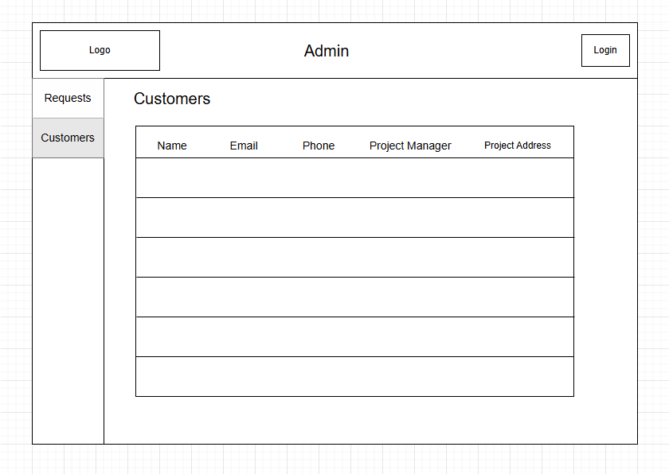
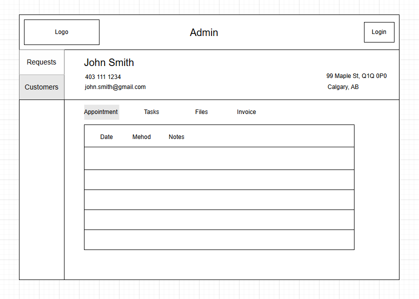

# Home Renovation Business Website – Design Document

## 1. Overview

- **Project Name:** Home Renovation Web System  
- **Client:** Bo Cen, James Grieve  
- **Developer:** Clarisse Buniel, David Rochefort, Evan Gamble, Xiaojing Shi  
- **Tech Stack:** React, ASP.NET API, PostgreSQL, Docker

## 2. Goals & Objectives

- Provide an intuitive platform for homeowners to browse services, get inspired, and submit renovation requests.  
- Empower the renovation company team with an internal portal for CRM, task management, and quoting.  
- Centralize data for better efficiency and customer relationship management.

## 3. Functional Requirements

### 3.1 Public Website (Homeowners)

#### 3.1.1 User Authentication

- Register / Login / Logout  
- Email confirmation / password reset

#### 3.1.2 Services Browsing

- Pages for:
  - Kitchen Remodels
  - Bathroom Renovations
  - Basement Finishing
  - Home Additions
- Each service includes:
  - Descriptions  
  - Photo Gallery (taggable by style, room type, budget)  
  - Filtering with tags or criteria

#### 3.1.3 Renovation Request Form

- Multi-step form with fields:
  - Service Type  
  - Room Dimensions  
  - Preferred Materials  
  - Design Style Tags  
  - Target Budget  
  - Location  
  - File Uploads (inspiration images, floorplans)  
- Optional: Integration or placeholder for 3D modeling tool (future enhancement)  
- Data captured and stored in database

### 3.2 Admin Portal (Renovation Team)

#### 3.2.1 Request Management

- View all incoming renovation requests  
- Commenting system on each request  
- Assign requests to Project Managers  
- Generate customized quotes and previews

#### 3.2.2 CRM Dashboard

- Customer profiles with contact info  
- Communication history (email log, notes)  
- Scheduling calendar  
- Project/job status tracking  
- Task lists for team members  
- File uploads per project (invoices, contracts)  
- Invoice creation and download  
- Optional: Payment process (future enhancement)

## 4. Solution-level Requirements

- Responsive design  
- Secure file uploads and authentication (HTTPS, token-based or cookies)  
- Scalable backend and modular MVC structure  
- Data validation on client and server side  
- Activity logs for request processing

## 5. System Architecture

### 5.1 Architecture Overview

The system follows a modular, service-oriented architecture designed to support both client-facing (Homeowners) and internal business operations through secure and scalable web applications.

**Primary Components:**

- React Single Page Applications (SPA) for UI  
- .NET MVC-based RESTful API for business logic  
- PostgreSQL database for data persistence  
- File system for document and media storage  
- JWT-based authentication and authorization

### 5.2 Technology Stack

- **Frontend:** React SPA  
- **Backend:** ASP.NET MVC / Web API  
- **Database:** PostgreSQL  
- **Authentication:** JWT (JSON Web Tokens)  

### 5.3 Database (SQL Server)

**Main Tables:**

- Users (Homeowners and Admins)  
- Services  
- Tags  
- Photos
- RenovationRequests  
- Projects  
- Invoices  
- Tasks
- Files  
- Communications 

### 5.4 Authentication & Roles

- Role-based access (Admin, Project Manager, Homeowner)  
- ASP.NET Identity for authentication  
- Authorization filters on controller actions

## 6. UI/UX Wireframes

## 7. 3D Room Planning Tool (Optional / Future Phase)

- Embed existing web-based 3D planner (like Planner 5D, Roomstyler) or integrate a custom module via iframe  
- Let users save/export designs with their request

## 8. Deployment Plan

- **Hosting:** Azure or IIS-based Windows hosting  
- **CI/CD:** Manual or GitHub Actions for deployments  
- **Backups:** Daily SQL Server backups

## 9. Timeline (Tentative)

| Phase                | Duration | Description                          |
|----------------------|----------|--------------------------------------|
| Planning & Wireframes| 2 weeks  | Gather assets, finalize pages        |
| Backend Dev          | 1 week   | Setup EF, DB schema                  |
| Frontend Dev         | 1 week   | Build pages & forms                  |
| Admin Panel          | 1 week   | Dashboard, CRM, invoice tools        |
| Testing & QA         | 1 week   | Manual + automated tests             |

## 10. Risks & Assumptions

- 3D tool might require third-party licensing  
- Reference images and file uploads could be large – need file size limits  
- Quote generator logic may grow in complexity