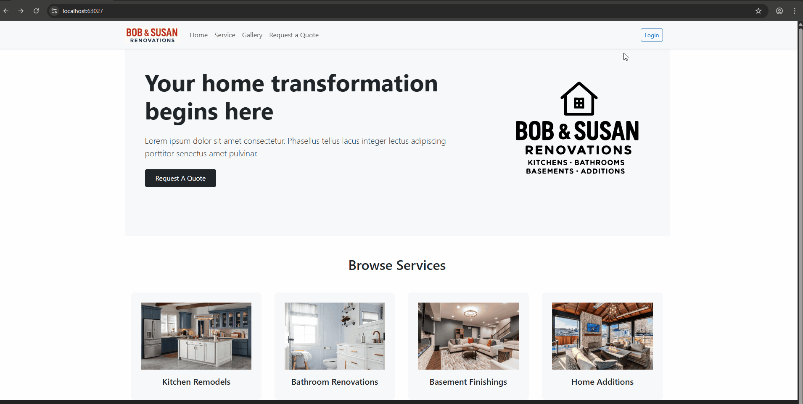
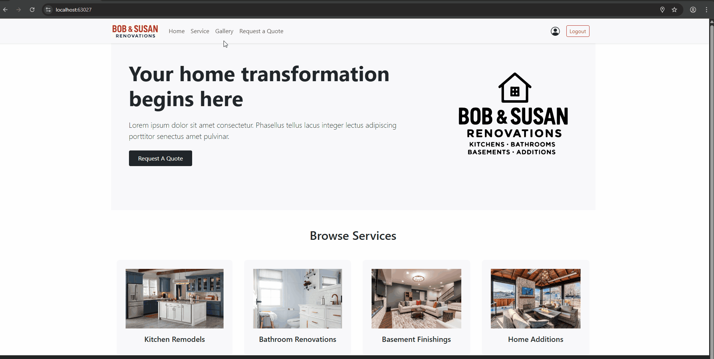

# Renovation Project

A full-stack web application developed for **Bob & Susan Renovations**, designed to streamline communication and project management for both homeowners and contractors. Built with a modern tech stack, the app supports secure authentication, service browsing, project tracking, and more.

---

## 🔧 Tech Stack

* **Backend:** .NET Core API
* **Frontend:** React
* **Database:** PostgreSQL
* **Containerization:** Docker
* **Reverse Proxy:** NGINX

---

## 📁 Project Structure

```
project-root/
├── RenovationApp.Server/     # Backend API (.NET Core)
├── renovationapp.client/     # Frontend (React)
├── docker-compose.yml        # Docker configuration
├── nginx.conf                # NGINX configuration
└── certs/                    # SSL certificates
```

---

## 🚀 Getting Started

### Prerequisites

Ensure you have the following installed:

* [.NET 8 SDK](https://dotnet.microsoft.com/en-us/download/dotnet/8.0)
* [Node.js + npm](https://nodejs.org/)
* [PostgreSQL](https://www.postgresql.org/)
* [Docker & Docker Compose](https://docs.docker.com/desktop/)

Also, configure your environment variables as described below.

### Environment Variables

Create a `.env` file in the project root and include:

```env
POSTGRES_USER=your_db_user
POSTGRES_PASSWORD=your_db_password
POSTGRES_DB=your_db_name
```

### Running the Application

1. **Clone the repository**

2. **Start Docker Desktop**

3. **Launch the project**

   * Open `RenovationApp.sln` in Visual Studio.
   * Select `docker-compose` as the startup item and run.

This will:

* Set up the PostgreSQL database
* Build and run the backend and frontend
* Start the NGINX reverse proxy

4. **Access the App**

   * Frontend: [http://localhost](http://localhost)
   * Backend API: [http://localhost/api](http://localhost/api)
   * Swagger Docs: [https://localhost:60848/swagger/index.html](https://localhost:60848/swagger/index.html)

---
## 📋 Usage

### 🔑 Authentication
Clicking the Login will direct you to the sign up / sign in page.

1. **Registration**
- Sends a confirmation email
- Complete the rest of the registration form.

2. **Login**
- Enter your credentials on the login page



### 👤 Users
#### Public
1. **Browsing Services**
- Navigate to the Service tab to view available options.
2. **Gallery**
- Navigate to the Gallery tab to view all project photos.
- Filterable by room type, style, and budget



#### 🏠 Homeowners (Logged in)
1. **Submitting a Renovation Request**
- Navigate to the Request a Quote
- Fill out the details form
- Upload (multiple) files for references
- Submit and wait for contractor response

2. **Account Management**
- Navgiate to the user profile icon
- Edit and save personal information
- Edit address

3. **Check Renovation Requests**
- Under Account Management section, navigate to Submitted Requests
- See all submitted requests
- Check status progress on requests
- View details on submitted requests

### 🧰 Contractors
Contractors and Admins are directed to the internal dashboard.

1. **Managing Requests**
- View incoming requests on the Requests tab
- View details of submitted requests
- Accepting requests generates project and creates a quote estimate to send

2. **Generate Quotes**
- Use quote builder to itemize costs
- Add or remove items as needed
- Edit items as needed
- Send to homeowner for approval

3. **Project Management**
- Navigate to Projects tab
- Track all or ongoing projects
- Update project status
- View projects

4. **Project Details**

   **Overview Tab**
   - View project and contact details
   - Add notes to project as needed
   - See tasks for the project

   **Files Tab**
   - View files from submitted request form
   - Add or delete files

   **Invoices Tab**
   - View invoices for project
   - Check payment status

## 🧰 Features

### 🏠 Homeowner Portal

* Account registration with email verification
* Browse renovation services
* Submit detailed renovation requests
* View a searchable, filterable project gallery

### 🧰 Contractor Portal

* Manage renovation requests
* Assign project managers
* Create and send custom quotes
* Chat with homeowners
* Track project timelines and status
* Use built-in CRM tools and calendars

---

## 👥 Roles & Permissions

| Role            | Capabilities                                                   |
| --------------- | -------------------------------------------------------------- |
| Homeowner       | Browse services, submit requests, view gallery                 |
| Project Manager | Manage requests, assign projects, communicate, generate quotes |
| Admin           | Full access to users, services, and system settings            |

---

## 🔮 Future Enhancements

* 3D Room Planner integration
* Payment gateway support
* SMS notifications
* Advanced analytics dashboard

---

## 👨‍💻 Authors

* Clarisse Buniel
* David Rochefort
* Evan Gamble
* Xiaojing Shi

---

**Created:** 2025-04-25
**Last Updated:** 2025-05-07