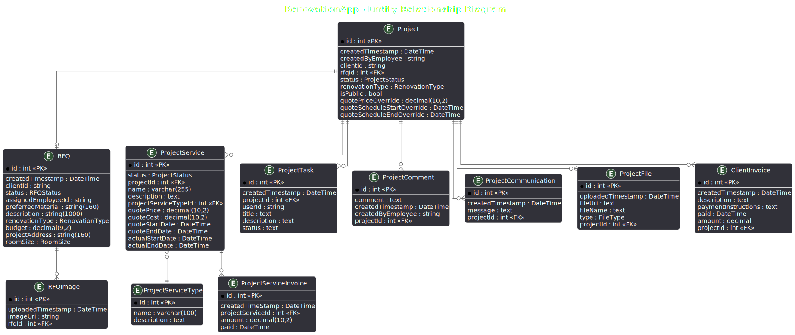

# Renovation Station Test Plan

<details>
<summary>Table of Contents</summary>

- [Executive Summary](#-executive-summary)
- [Overview](#-overview)
- [Scope](#-scope)
  - [Out of Scope](#️-out-of-scope)
- [Stakeholder Roles in Testing](#-stakeholder-roles-in-testing)
- [User Role Coverage Matrix](#-user-role-coverage-matrix)
- [System Overview](#️-system-overview)
- [Targeted User Scenarios](#-targeted-user-scenarios-)
- [Form Validation Strategy](#-form-validation-strategy)
  - [Form Validation Coverage Table](#-form-validation-coverage-table)
- [Functional End-to-End Test Scenarios](#-functional-end-to-end-test-scenarios)
- [Frontend UI Test Cases](#️-frontend-ui-test-cases)
- [Backend Test Cases](#-backend-test-cases)
  - [Positive Test Scenarios](#-positive-test-scenarios)
- [Negative Test Scenarios (Invalid Input & Unauthorized Access)](#️-negative-test-scenarios-invalid-input--unauthorized-access)
- [Edge Case Test Scenarios](#️-edge-case-test-scenarios)
- [Success and Error Conditions](#️-success-and-error-conditions)
- [Testing Tools](#-testing-tools)
- [Testing Timeline](#️-testing-timeline)
- [Risks and Assumptions](#️-risks-and-assumptions)
- [Entry and Exit Criteria](#-entry-and-exit-criteria)
- [Final Acceptance Criteria](#-final-acceptance-criteria)
- [Appendix A: Entity Relationship Diagram (ERD)](#-appendix-a-entity-relationship-diagram-erd)
- [Last Update / Creation Date](#last-update--creation-date)

</details>

## Executive Summary

This test plan outlines the strategy, scenarios, and validation criteria used to ensure the Renovation Station platform delivers a reliable, secure, and user-friendly experience for homeowners and Project managers.


## Overview

This document defines the scope, components, success and error conditions for a web platform with a back-end service designed to meet the requirements of the ***Bob & Susan Renovations*** company.


## Scope

- **Frontend**: React-based UI for homeowners and Project managers.
- **Backend**: RESTful API using a modern backend framework (e.g., Node.js, ASP.NET MVC (C#)).
- **Database**: PostgreSQL.
- **Authentication & Authorization**: Microsoft Entra ID (Azure Active Directory).

### Out of Scope:

- Performance/load testing (unless explicitly added)
- Third-party services (e.g., Payments)
- 3D Room Planner
- Short message service (SMS) integration


## Stakeholder Roles in Testing

| Role | Main Responsibilities |
|------|-----------------------|
| **Client / Business Owner** | - Approve feature expectations<br>- Provide sample renovation specs or mock data<br>- Review User Acceptance Testing (UAT) feedback<br>- Provide written sign-off |
| **Homeowner Testers** | - Register an account<br>- Browse renovation services<br>- Filter galleries<br>- Submit Request for quote (RFQ)<br>- Enter test results in UAT feedback document |
| **Admin/Staff Testers** | - Access admin dashboard<br>- Assign project managers<br>- Manage RFQ lifecycles<br>- Manage user profiles<br>- Oversee communication logs and calendar tasks<br>- Enter test results in UAT feedback document |
| **Project Manager Testers** | - Log in to portal<br>- Review incoming RFQ<br>- Submit quotes and update project statuses<br>- Enter test results in UAT feedback document |
| **Development Team** | - Support UAT environment<br>- Fix bugs raised in UAT feedback document <br>- Coordinate test deployment |
| **Quality Assurance (QA) Team** | - Prepare and manage test cases<br>- Log and validate bug reports<br>- Ensure critical paths are tested |


### User Role Coverage Matrix

| **Feature / Test Area**      | **Homeowner** | **Project Manager** | **Admin/Staff** |
|-----------------------------|----------------|----------------------|------------------|
| Register/Login              | ✅              | ✅                   | ✅               |
| Browse Renovation Services  | ✅              |                      |                  |
| Submit RFQ   | ✅              |                      |                  |
| View Gallery                | ✅              | ✅                   |                  |
| Assign Project Manager      |                | ✅                   | ✅               |
| Quote Generation            |                | ✅                   | ✅               |
| Communication Log           | ✅              | ✅                   | ✅               |
| Task Calendar Access        |                | ✅                   | ✅               |

## System Overview

### Environment

- Dedicated staging server isolated from production
- Includes demo data and login accounts

### Models

- **Homeowner**: First/Last Name, Address, Contact Info, Account Details
- **Gallery**: Photos, Renovation Type, Tags
- **RenovationType**: Name (e.g., Kitchen, Bathroom)
- **RequestForQuote**: Room Dimensions, Materials, Budget, Notes, Requestor
- **Project**: Linked RFQ, Status, Assigned Manager, Start Date, End Date
- **CommunicationLog**: Linked to RFQ or Project, contains timestamp, author, message content
- **TaskCalendar**: Task name, assigned user, due date, completion status, linked to a specific project

### Views

- `/register`: Homeowner registration
- `/login`: Homeowner/staff login
- `/profile`: User profile page
- `/services`: Renovation services
- `/gallery`: View past projects
- `/submit-rfq`: RFQ submission
- `/project-manager`: Project manager dashboard

### Controllers / Business Logic

- Handle authentication, user management
- Display galleries and services
- Process RFQ
- Manage project workflows

## Targeted User Scenarios

- [x] User Registration & Login
- [x] Email Confirmation
- [x] Responsive Layout Validation
- [x] Gallery Viewing and Filtering
- [x] RFQ Lifecycle (Submit, Comment, Quote)
- [x] Project manager Dashboard Access
- [x] Project Management and Task Updates
- [x] Quote Generation and Invoicing


## Form Validation Strategy

All forms (registration, login, RFQ submission) will undergo validation testing to ensure:
- Required fields enforce input
- Correct formats (email, phone numbers) are validated
- Limits (e.g., maximum file size, allowed file types) are respected
- Invalid submissions show user-friendly error messages
- The form does not submit if validation fails
- Valid submissions correctly post data to the backend API

Validation will be tested using manual input testing and automated Playwright tests where appropriate.

## Form Validation Coverage Table

The Form Validation Coverage Table outlines the field-level validation rules applied to key forms across the platform, including user registration, login, and RFQ submission.  

Each input is tested against specific constraints (such as required fields, character limits, acceptable formats, and upload restrictions) to ensure proper error handling and user guidance.  

These rules serve as the basis for the positive, negative, and edge case test scenarios that follow.

| Form Field               | Validation Rule                                                                 | Error Message                                       |
|--------------------------|----------------------------------------------------------------------------------|-----------------------------------------------------|
| First Name               | Required, 2–50 alphabetic characters only                                        | “Please enter a valid first name.”                  |
| Last Name                | Required, 2–50 alphabetic characters only                                        | “Please enter a valid last name.”                   |
| Email                    | Required, valid email format                                                     | “Invalid email address format.”                     |
| Phone Number             | Optional, numeric only, 10–15 digits                                             | “Please enter a valid phone number.”                |
| Preferred Materials  | Required, free-text string, 2–160 characters, alphanumeric only (letters and numbers, no symbols)                           | “Please enter a valid description of material using only letters and numbers.”      |
| Room Size (RFQ)    | Required. 2–30 characters. Only alphabetic characters and spaces allowed. No numbers or punctuation. Descriptive, not generic                        | “Please enter a valid room size (e.g., 'Master Bedroom', 'Spacious Kitchen')”               |
| Budget (RFQ)             | Required, must be a positive number                                              | “Budget must be greater than 0.”                    |
| File Upload              | Max 10MB, allowed types: jpg, png, pdf                                           | “File exceeds 10MB or unsupported type.”            |
| Design Style (RFQ)       | Optional, must be selected from dropdown                                         | “Invalid design style selected.”                    |

---

### Functional Test Scenarios


```
Test Case #1: Responsive Layout Testing

Preconditions:
- Use tools, such as Playwright or browser dev tools

Steps:
1.	Open homepage on desktop, tablet, and mobile resolutions
2.	Navigate through services, gallery, and RFQ form
3.	Interact with inputs, filters, menus

Expected Result:
•	Layout adjusts for screen size
•	No elements overlap or break
•	Navigation remains usable
```

```
Test Case #2: Role Access Restriction for Project manager

Preconditions:
- Project manager account is logged in

Steps:
1. Attempt to access `/admin` role

Expected Result:
- Project manager is redirected or shown “Access Denied”
- No data from admin panel is leaked
```

```
Test Case #3: File Upload Limit Exceeded

Preconditions: 
- User is logged in (homeowner or Project managers)
- RFQ or Project File Upload form is available

Steps:
1. Navigate to the file upload section (e.g., RFQ form or document management)
2. Select a file larger than 10MB (e.g., 12MB PDF or image)
3. Attempt to upload the file

Expected Result:
- Upload is rejected
- Clear error message is displayed: "File exceeds the maximum allowed size of 10MB."
- File is not stored or referenced in the database
- No backend exceptions or server crashes
```

```
Test Case #4: Upload Invalid File Type

Preconditions:
- User is logged in
- File upload field is accessible

Steps:
1. Navigate to file upload section
2. Select an `.exe` or `.js` file
3. Attempt to upload

Expected Result:
- Upload is rejected
- Error message:
    “Unsupported file type”
- No file saved or logged
```

```
Test Case #5: Log Communication on RFQ

Preconditions:
- Project manager is logged in
- A RFQ exists

Steps:
1. Navigate to RFQ details page
2. Enter a message in the communication/comment section
3. Submit the message

Expected Result:
- Message appears in communication log with author name and timestamp
- Other users can view the message
- Message is saved in the database and persists on reload
```

```
Test Case #6: Assign Project Manager to RFQ

Preconditions:
- RFQ exists
- Project manager or admin logged in

Steps:
1.	Open RFQ
2.	Choose a project manager from dropdown
3.	Save assignment

Expected Result:
•	RFQ updated with assigned PM
•	Assignment shows in RFQ details
```

```
Test Case #7: Orphaned Project Prevention

Preconditions:
- RFQ exists and is linked to a project

Steps:
1. Delete the linked RFQ (if allowed)
2. Check the associated project

Expected Result:
- Either RFQ deletion is prevented or Project is updated to reflect loss
- No foreign key violations
```

```
Test Case #8: Create and View Calendar Task for a Project

Preconditions:
- Admin or Project Manager is logged in
- Project exists with task management enabled

Steps:
1. Go to project details
2. Create a new task with a title, due date, and assignee
3. Save the task
4. Navigate to calendar view

Expected Result:
- Task appears in project task list
- Task is visible on calendar at correct due date
- Assigned user can view the task in their dashboard
```

---

## Authentication Test Scenarios - Microsoft Entra ID (Azure AD) Integration Tests

| Test Case ID | Scenario                                  | Expected Outcome                                |
|--------------|-------------------------------------------|-------------------------------------------------|
| AUTH-001     | Sign in with valid Microsoft account      | User is successfully authenticated              |
| AUTH-002     | Sign in with unregistered Microsoft account | Access is denied with appropriate error message |
| AUTH-003     | Token expiration                          | User is prompted to re-authenticate             |
| AUTH-004     | Role-based access (Admin vs User)         | Access is granted or denied based on role       |

---

## Frontend UI Test Cases

These test cases validate React component behavior, interaction flows, and conditional rendering using **Jest** and **React Testing Library**.

| Test Case ID | Component / Page | Scenario | Expected Result |
|--------------|------------------|----------|-----------------|
| FE-UI-01 | `<LoginForm />` | User enters invalid credentials and clicks Submit | Error message is shown: "Invalid username or password." |
| FE-UI-02 | `<RFQForm />` | Required fields left empty | Fields are highlighted, and errors are displayed next to each |
| FE-UI-03 | `<Gallery />` | No gallery items in state or from API | UI displays "No projects available" message |
| FE-UI-04 | `<Header />` | Logged-in user with JWT visits the app | Nav bar shows “Profile” and “Logout” |
| FE-UI-05 | `<TaskCalendar />` | Tasks exist for selected date | Calendar renders with event markers; tooltip shows task name |
| FE-UI-06 | `<ProjectManagerDropdown />` | User clicks dropdown to assign PM | List of managers is displayed, selection updates state |
| FE-UI-07 | `<ProtectedRoute />` | User tries to access `/admin` without valid JWT | Redirect to login or show “Access Denied” |
| FE-UI-08 | `<FileUploader />` | User uploads invalid file (wrong type) | File rejected and error: “Unsupported file type” appears |
| FE-UI-09 | `<CommentSection />` | User posts a comment | New comment is added to thread with timestamp and username |
| FE-UI-10 | `<ServicesPage />` | User applies renovation type filter | Only matching services are displayed |

---

## Backend Test Cases

Backend test coverage for data validation, API behavior, and database interaction using EF Core and PostgreSQL.

### Positive Test Scenarios

| Test Case ID | Endpoint                      | Input                                | Expected Result                          |
|--------------|-------------------------------|--------------------------------------|------------------------------------------|
| BE-COM-01    | POST `/api/communication`     | Valid RFQ ID and message body        | 201 Created, comment saved and returned  |
| BE-TASK-01   | POST `/api/tasks`             | Valid task for project and due date  | 201 Created, task linked to project      |
| BE-GAL-06    | GET `/api/gallery`            | Valid renovation type and tag filter | 200 OK, filtered images                  |
| BE-CAL-01    | GET `/api/calendar`           | Valid JWT and assigned user ID       | 200 OK, user’s scheduled tasks           |


### Renovation Request (`POST /api/request`)

| Test Case ID | Description | Input | Expected Output |
|--------------|-------------|-------|-----------------|
| BE-RR-01 | Valid request | All required fields | `201 Created`, Request object returned |
| BE-RR-02 | Missing size | `room_size=`, ... | `400 Bad Request`, Error: "Room size required" |
| BE-RR-03 | Oversized budget | `budget=99999999` | `400 Bad Request`, Error: "Budget exceeds maximum allowed" |
| BE-RR-04 | Invalid file upload | `file=exe file` | `400 Bad Request`, Error: "Invalid file type" |

### Gallery Filtering (`GET /api/gallery?type=kitchen&tags=modern,budget`)

| Test Case ID | Description | Input | Expected Output |
|--------------|-------------|-------|-----------------|
| BE-GAL-01 | Filter by valid type and tags | `type=kitchen`, `tags=modern,budget` | `200 OK`, JSON array of matching images |
| BE-GAL-02 | Filter by type only | `type=bathroom` | `200 OK`, all bathroom-type images |
| BE-GAL-03 | Filter with unknown tag | `tags=unicorn-style` | `200 OK`, empty array |
| BE-GAL-04 | Missing all parameters | none | `200 OK`, full gallery list |
| BE-GAL-05 | Invalid query parameter | `type=123` | `400 Bad Request`, Error: "Invalid renovation type format" |

### Assign Project Manager (`PUT /api/project/{id}/assign`)

| Test Case ID | Description | Input | Expected Output |
|--------------|-------------|-------|-----------------|
| BE-PRJ-01 | Valid assignment | `project_id=5`, `assigned_employee_id=3` | `200 OK`, Project updated with manager info |
| BE-PRJ-02 | Nonexistent project ID | `project_id=9999`, `assigned_employee_id=3` | `404 Not Found`, Error: "Project not found" |
| BE-PRJ-03 | Invalid manager ID | `project_id=5`, `assigned_employee_id=xyz` | `400 Bad Request`, Error: "Invalid manager ID" |
| BE-PRJ-04 | Unauthorized request | No valid JWT | `401 Unauthorized`, Error: "Authentication required" |
| BE-PRJ-05 | Project already assigned | `project_id=5`, already has manager | `409 Conflict`, Error: "Project already assigned" |

### Get Project Details (`GET /api/project/{id}`)

| Test Case ID | Description | Input | Expected Output |
|--------------|-------------|-------|-----------------|
| BE-PRJ-06 | Valid project retrieval | `project_id=10` | `200 OK`, Project details JSON |
| BE-PRJ-07 | Invalid project ID format | `project_id=abc` | `400 Bad Request`, Error: "Invalid project ID format" |
| BE-PRJ-08 | Project not found | `project_id=4040` | `404 Not Found`, Error: "Project does not exist" |
| BE-PRJ-09 | Unauthorized access | No JWT | `401 Unauthorized`, Error: "Authentication required" |
| BE-PRJ-10 | Access denied for non-assigned user | JWT for a different user | `403 Forbidden`, Error: "Access denied" |

---


## Invalid Input & Unauthorized Access Scenarios Table

The Table outlines negative test scenarios to verify that the system correctly handles invalid inputs, unauthorized actions, and other failure conditions without compromising stability and security.


| Test Scenario                          | Invalid Input                  | Expected Result                                            |
|-----------------------------------------|---------------------------------|------------------------------------------------------------|
| Register with invalid email            | `user@invalid`                  | Error: "Invalid email address format."                    |
| Register with weak password            | `password`                     | Error: "Password must include uppercase, number, and symbol." |
| Submit RFQ with missing room size | Leave Room size blank    | Error: "Please enter valid room size."               |
| Submit RFQ with negative budget         | `-1000`                         | Error: "Budget must be greater than 0."                    |
| Upload file exceeding size limit        | Upload 12MB file                | Error: "File exceeds maximum allowed size of 10MB."        |
| Upload unsupported file type            | Upload `.exe` file              | Error: "Unsupported file type."                            |
| Access admin panel without permission   | Project manager tries to visit `/admin` | Shown "Access Denied" page or redirected |
| Submit empty comment in communication log | Submit blank message field    | Error: "Message cannot be blank."                          |


## Edge Case Test Scenarios Table

The Edge Case Test Scenarios Table describes edge case scenarios to ensure the system behaves correctly when handling unusual, extreme, or boundary input values.


| Test Scenario                                | Edge Input Example              | Expected Result                                                |
|-----------------------------------------------|----------------------------------|----------------------------------------------------------------|
| Register with maximum allowed first name length | 50-character first name         | Registration succeeds if within limit                         |
| Submit RFQ with minimum budget                | Budget set to `0.01`             | RFQ submission succeeds if rules allow budget > 0              |
| Upload maximum allowed file size              | Upload file exactly 10MB         | File accepted and uploaded successfully                       |
| Submit RFQ with uncommon room size label          | Room size set to `extra spacious`     | RFQ accepted if it meets validation (2–30 alpha-only chars); otherwise validation error                                        |
| Upload maximum number of files (if multiple allowed) | Attach 5 images if limit is 5 | Upload succeeds; system does not accept more than allowed      |
| Submit very large notes/comments in RFQ        | 5000 characters in Notes field   | Submission succeeds if within database/text field limits       |
| Browse gallery with no available photos        | Empty gallery page               | User sees "No projects available" message instead of error     |
| Submit calendar task with due date today       | Assign task with today's date    | Task successfully created and shown in calendar view           |


## Success and Error Conditions

### Overall Success Criteria
- at least 2 homeowners complete full test journey
- At least one Project manager submits a quote
- at least 1 Project manager user performs end-to-end quote process
- Create and submit at least 1 RFQ
- View filtered galleries
- Upload relevant files


## Testing Tools

| Tool | Purpose |
|------|---------|
| **Docker** | Run isolated PostgreSQL containers for dev/test |
| **Jest / React Testing Library** | Unit/component tests — frontend interacting with backend |
| **xUnit / NUnit** | Test C# models, services, and data access logic |
| **Playwright** | Test end-to-end data flow (e.g., form -> API -> database) |
| **PostgreSQL** | Test database fixtures |


## 🗓️ Testing Timeline

| **Phase** | **Activities** | **Dates** | **Responsible** |
|-----------|----------------|-----------|------------------|
| Unit Testing | Backend and frontend unit/component testing | April 26 – April 30, 2025 | Development Team |
| Integration Testing | API authentication, database relationships | May 1 – May 3, 2025 | Development Team + QA |
| Staging Deployment | Deploy full system with demo data | May 4, 2025 | Development Team |
| User Acceptance Testing (UAT) | Stakeholder user journeys | May 5 – May 10, 2025 | QA + Stakeholders |
| Bug Fix Sprint | Resolve UAT-discovered issues | May 11 – May 14, 2025 | Development Team |
| Final Client Review | Final walkthrough and feedback | May 15 – May 17, 2025 | Client + PM |
| Production Deployment | Launch to production | May 20, 2025 | Development Team |

```
⚠️ Note

Dates in this plan are tentative and may be adjusted as needed based on development progress, stakeholder availability, feedback,
unforeseen issues, or testing outcomes.

Any significant schedule changes will be communicated promptly to all stakeholders.
```

## Risks and Assumptions

| **Risk/Assumption** | **Description** | **Mitigation** |
|---------------------|-----------------|----------------|
| Stakeholder availability | Delays in UAT feedback | Identify backup testers, reminders |
| Demo data issues | Missing or incorrect data | Pre-review and validate staging data |
| API/backend delays | Integration delays | Use mocks, early integration |
| Browser/device compatibility | UI issues on mobile or old browsers | Test on Chrome, Edge, iOS, Android |
| Short fix timeline | Last-minute critical bugs | Buffer days after UAT for bug fixes |

---

##  Test Entry and Exit Criteria

### Entry Criteria

- All critical features deployed to staging
- Demo data populated
- Test users/accounts created
- APIs reachable and authenticated
- Test scenarios approved

### Exit Criteria

- All critical/high bugs resolved or mitigated
- 90%+ test case pass rate
- Core user journeys validated
- Client provides written UAT sign-off
- Go-live checklist reviewed and approved


## ✅ Final Acceptance Criteria

| Criteria Area | Requirements |
|---------------|--------------|
| **Functionality** | - Critical workflows operate without major bugs<br>- Forms validate correctly and submit to backend<br>- Communication logs and calendar tasks function reliably |
| **Usability** | - UI is easy to navigate for clients<br>- Filters, galleries, and quotes are understandable<br>- Calendar and comment interfaces are intuitive |
| **Security** | - Only authorized users access homeowner profiles, RFQ, and communication logs |
| **Performance** | - Pages load within 2 seconds on staging<br>- Uploads and file previews work as expected |
| **Client Sign-off** | - Written approval from client confirming feature readiness and business fit |

---

---

## Appendix A: Entity Relationship Diagram (ERD)

The diagram below illustrates the core data model relationships used in the Renovation Station platform.



### Model Relationships Summary

- **Homeowner → RequestForQuote (1:M)**  
  A homeowner can submit multiple RFQs, each linked back to their user account.

- **RequestForQuote → Project (1:1 or 1:M)**  
  Each RFQ may result in a project. A project references the RFQ it was based on.

- **Project → TaskCalendar (1:M)**  
  A project contains one or more tasks, used for scheduling and management.

- **Project → CommunicationLog (1:M)**  
  Messages related to the project or RFQ are stored in the communication log.

- **Project → ProjectManager (M:1)**  
  Each project is assigned to a project manager (admin/staff user).

- **Gallery → RenovationType (M:1)**  
  Each gallery item (photo or video) is categorized by renovation type.

- **RequestForQuote → RenovationType (M:1)**  
  Each RFQ is tagged with a renovation type like Kitchen, Bathroom, etc.

---


### Last Update

2025-04-30

### Creation Date

2025-04-18